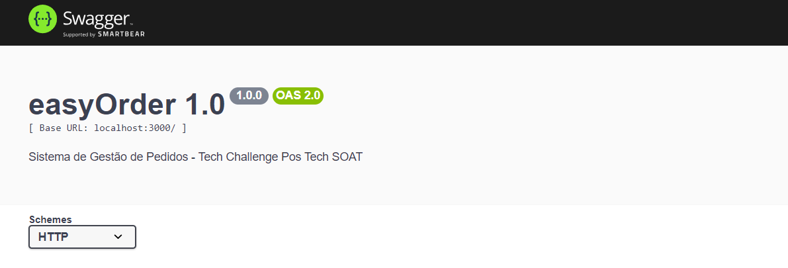
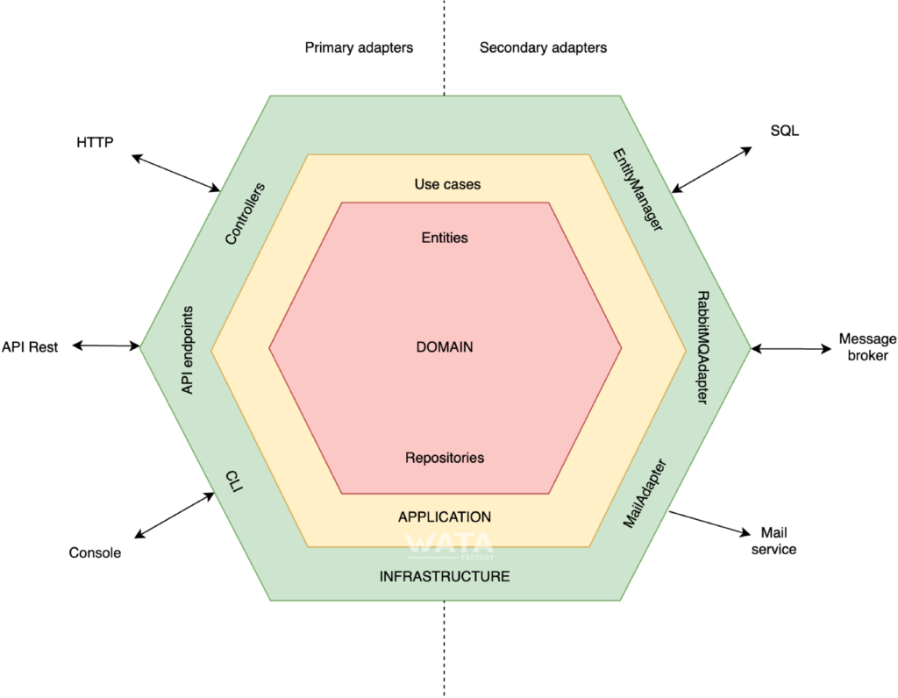

# easyOrder: Aplicação Tech Challenge POS TECH SOAT8 FIAP - Grupo 03


## ✒️ Grupo / Autores

O Grupo que implementou a solução (Grupo 03), é composto pelos seguintes integrantes (nome, email, RM, discord):
- Bruno Moreira Reis: brbrno@hotmail.com, RM358025, @bruno_m_reis
- Carlos Henrique de Lima, carlos334lima@gmail.com, RM356875, @carloslima2235 
- Fernando Gurkievicz, fergkz@gmail.com, RM357072, @goorkz
- Marcio Saragiotto, marcio.saragiotto@gmail.com, RM357349, @msgiotto
- Rafael da Silva Andrade, rafaandrade_@outlook.com, RM357010, @andrade_rafael

&nbsp;
## Projeto - Descrição e Objetivos 

A aplicação __easyOrder__ foi implementada como parte do _Tech Challenge_ da primeira etapa da Pós Tech de Arquitetura de Software (Turma SOAT8) da FIAP. Esse desafio simula a implantação de uma solução para uma Lanchonete de bairro expandir e alavancar seu negócio através da automação de parte dos seus processos, incluindo a _Realização do pedido e pagamento_ e o processo de _Preparação e entrega do pedido_.

 Outros requisitos (incluindo requisitos não funcionais e de desenho de arquitetura) também foram solicitados, e são explicados ao longo desse documento. O enunciado do Problema original pode ser consultado [nesse link](./docs/README-Problema.md).

O desafio iniciou na etapa de mapeamento de requisitos utilizando conceitos e técnicas do DDD (_Domain Driven Design_) em dinâmicas de _Event Storming_. As sessões de trabalho mapearam o entendimento do Grupo sobre o problema em um fluxo visual que está disponível no Miro.

O processo de Event Storming considerou:
- Discussão inicial sobre domínios/subdomínios
- Construção do Dicionário de Linguagem Ubíqua
- Brainstorming de Eventos
- Construção da linha do tempo do Fluxo de Eventos
- Identificação de pontos de atenção e Eventos Pivotais
- Identificação de Comandos, Atores e Políticas
- Identificação de Modelos de Leitura e Sistemas Externos
- Por fim, a Identificação de Agregados e Contextos Delimitados, que nos deram orientação para início da etapa de migração para o código.

O Miro aberto para visualização pode ser acessado através do link: [https://miro.com/app/board/uXjVK4O1cns=/?share_link_id=173867557493](https://miro.com/app/board/uXjVK4O1cns=/?share_link_id=173867557493). Caso o link não abra  automaticamente, copie e cole na barra de navegação.


&nbsp;
## Requisitos de Arquitetura da Aplicação

Os requisitos apontados no desafio consideram:

- Implantaçao da Aplicação somente com Backend (não é necessário front)

- Implantação considerando Arquitetura Hexagonal

- APIs documentada com respectivos *Swaggers*, que considere ao menos:
    - Cadastro de Clientes
    - Identificação de Clientes por CPF
    - Criação, edição e remoção de Produtos
    - Busca de produtos por Categoria
    - Fake checkout, com envio de Pedidos para a fila de Preparação
    - Listar os pedidos

- O Banco de Dados à escolha do Grupo - foi utilizado o mySQL nesta implementação
    - Persistência: Organização da fila de Pedidos em Banco de Dados

- Dockerfile configurado e docker-compose.yml para ambiente completo
	- Limitado a 1 banco de dados e 1 instância para aplicação

- Repositório Github ([https://github.com/pos-tech-fiap-projects/easyOrder](https://github.com/pos-tech-fiap-projects/easyOrder))

A aplicação foi implementada utilizando a linguagem [Typescript](https://www.typescriptlang.org/pt/), seus pré-requisitos padrão (Node, Ts-Node, etc) e inclui a utilização de alguns pacotes como apoio:
- [Express](https://expressjs.com/) como framework minimalista de Web Application
- [Swagger-autogen](https://swagger-autogen.github.io/docs/) e [Swagger-ui-express](https://www.npmjs.com/package/swagger-ui-express) para documentação Swagger dos endpoints / APIs
- [Mysql2](https://www.npmjs.com/package/mysql2) e [Sequelize](https://sequelize.org/) para implementação de persistência em Banco de Dados
- [Axios](https://www.npmjs.com/package/axios) e [Jest](https://www.npmjs.com/package/ts-jest) para Testes Ponta a Ponta

O detalhamento técnico da Arquitetura, tecnologias utilizadas e detalhamento de como foi realizada a implementação podem ser encontrados na sessão 'Arquitetura do Sistema'.

&nbsp;
## Como Rodar o easyOrder

### 📋 Pré-requisitos

- Docker e Docker-compose instalados
- Git para baixar o repositório localmente

Todas as dependências e pré-requisitos serão atendidos pela execução do docker-compose, conforme explicado abaixo.

### ⚙️ Iniciando Em Modo "Produção"

Inicializar o Git e Clonar o repositório em uma pasta local, com os comandos:

``` console
git clone https://github.com/pos-tech-fiap-projects/easyOrder.git

cd easyOrder/
```

Para iniciar o _build_ da aplicação já atendendo aos pré-requisitos e rodar no servidor, podem ser executados os seguintes comandos:

1. Buildar a aplicação de acordo com o arquivo docker-compose.yml
    
    Windows:
    ``` console
    docker compose up --build
    ```

    Linux:
    ``` console
    sudo docker-compose up --build
    ```

### 🔧 Iniciando Em Modo "Desenvolvimento"

Para desenvolver, você deve iniciar o docker com a aplicação apontando e monitorando para os arquivos locais.

Inicializar o Git e Clonar o repositório em uma pasta local, com os comandos:

``` console
git clone https://github.com/pos-tech-fiap-projects/easyOrder.git

cd easyOrder/
```

Para não impactar no docker-compose de produção, copie o arquivo `docker-compose.override.sample` e renomeie para `docker-compose.override.yml`.

Esse arquivo "override" permite que você altere qualquer configuração somente na sua máquina, sem versionar ou alterar o status de produção.

Com o novo arquivo, basta rodar:

``` console
docker-compose up
```

Também é necessário renomear o arquivo `.env-sample` para `.env` e incluir as suas configurações de desenvolvimento.

*Para obter as informações adicionais de desenvolvimento, entre em contato com a equipe*

### ✅ Verificar se está funcionando

Neste ponto, o serviço deve estar ativo, para verificar se está funcionando, basta acessar a url [http://localhost:3000/](http://localhost:3000/). 

O endpoint [http://localhost:3000/health](http://localhost:3000/health) também deve indicar que o servidor está rodando corretamente, com todos os serviços ativos.

_Caso esteja acessando a aplicação de outro host, favor modificar a URL para o endereço correto do seu host._

### 💡 Acesso à Documentação do Swagger

Para acessar a documentação do Swagger, acessar a url [http://localhost:3000/doc/](http://localhost:3000/doc/)




_Caso esteja acessando a aplicação de outro host, favor modificar a URL para o endereço correto do seu host._

### 🔩 Rodando Testes Ponta a Ponta (_End-to-end - E2E_)

Um roteiro completo de Testes Ponta a Ponta está disponível para facilitar a validação do processo da aplicação. Para executar o teste ponta a ponta, através do ambiente ativo no Docker, rode em um outro terminal (mantenha a aplicação rodando no Docker).

``` console
docker exec -it easyorder npx jest ./app.e2e.test.ts --verbose true
```

O resultado dos testes Ponta a Ponta deve ser similar ao abaixo:


&nbsp;
&nbsp;
# 🛠️ Arquitetura do Sistema

A arquitetura utilizada no Sistema foi a [Arquitetura Hexagonal](https://www.alura.com.br/videos/o-que-e-arquitetura-hexagonal--c1134), também conhecida como Ports and Adapters. A arquitetura hexagonal tem como objetivo estruturar aplicações que sejam independentes de frameworks, interfaces, bancos de dado e outros elementos externos. 

O diagrama abaixo mostra de forma macro como ela considera a separação entre camadas (core, aplicações e infraestrutura), assim como sua divisão entre lado 'esquerdo' que representa os adaptadores primários (drivers) que representam formas de acessar a aplicação e lado 'direito' que representa os adaptadores secundários (driven) que mostram como a aplicação interage com sistemas / dependências externas.



Nosso objetivo aqui não é entrar em detalhes de como a arquitetura funciona, mas sim como ela foi implementada no nosso projeto.

## Estrutura de Pastas

    .
    ├── docs                   # Documentos adicionais
    ├── src                    # Código Fonte
    ├── Dockerfile                              
    ├── docker-compose.yml     
    ├── package.json           
    ├── tsconfig.json          
    └── README.md              

## Detalhamento da estrutura do Código Fonte

#### /src/easyorder/Core
- Este diretório é o Núcleo da aplicação, onde reside a lógica central que define o comportamento do sistema. Ele contém duas partes principais: Application e Domain.

#### /src/easyorder/Core/Application/Usecases
- Esta pasta armazena os casos de uso da aplicação, que são os comandos responsáveis por executar as regras de negócio.
- Os arquivos dentro desta pasta devem ter nomes que representem ações, sempre em forma de verbos.
- Cada caso de uso é representado por uma classe que segue um padrão:
    - O nome da classe reflete a ação a ser realizada.
    - A classe possui apenas um método público chamado execute, que contém a lógica principal.
    - O construtor da classe é utilizado para injetar os serviços e dependências necessárias para a execução do caso de uso.

#### /src/easyorder/Core/Domain/Entities
- Esta pasta contém as entidades de domínio da aplicação, que são representações dos principais objetos de negócio com suas propriedades e comportamentos. Estas entidades validam e trazem integridade ao domínio.
    - Também são utilizadas estruturas de ValueObject na respectiva pasta. Estas estruturas refletem o seu equivalente nos conceitos de DDD.

#### /src/easyorder/Core/Domain/Output/*
- Contém as portas de saída, que são interfaces definindo como os dados devem ser persistidos ou recuperados.
- Elas servem como um contrato entre a lógica de negócios e os adaptadores de infraestrutura que realizarão as operações de armazenamento/persistência ou comunicação com serviços externos.

#### /src/easyorder/Infrastructure/*
- Arquivos de framework. Direcionam e chamam comandos
- Lida com a implementação técnica de como o sistema interage com o mundo exterior, tecnologias específicas como bancos de dados, APIs externas, entre outros serviços.

#### /src/easyorder/Infrastructure/Input/*
- Adaptadores de entrada que implementam as portas de entrada definidas na camada de domínio.
- Esses adaptadores são responsáveis por receber solicitações do usuário,converter essas solicitações em comandos, e invocar os casos de uso apropriados.

#### /src/easyorder/Infrastructure/Output/*
- Adaptadores com a implementação dos adaptadores de saída/armazenamento da aplicação
- Estes adaptadores cuidam de todas as interações externas, como salvar dados em um banco de dados, garantindo que a lógica de negócios permaneça desacoplada das tecnologias específicas.

## Padrões que utilizamos no nosso Desenvolvimento

### Nomenclaturas:
- No final do nome do arquivo, sempre coloque o que é o arquivo (Service, Usecase, Interface, Endpoints, etc.)
- Variáveis devem começar com minúsculo em camelCase
- Arquivos e classes devem começar com maiúsculo em camelCase
- Constantes e variáveis de ambiente devem ser escritas em MAIÚSCULO

### Uso do git:
- Sempre em português
- Todo commit deve ser bem descritivo do que foi feito
- Fazer o menor tamanho de commit possívels
- Sempre em Branches (ramos) e depois fazer o merge
- No mínimo 1 aprovador de Pull Request
- Utilizar os seguintes prefixos, quando possível com o número da atividade no projeto:

    - `Hotfix: {NúmeroTask} - {mensagem}` Para bugs
    - `Feature: {NúmeroTask} - {mensagem}` Para implementar funcionalidades
    - `Chore: {NúmeroTask} - {mensagem}` Para alterações que não impactem o uso (débito técnico)

- O nome da branch deve ser igualmente o prefixo + id da atividade. Ex:

    - `hotfix/99999`
    - `feature/99999`
    - `chore/99999`