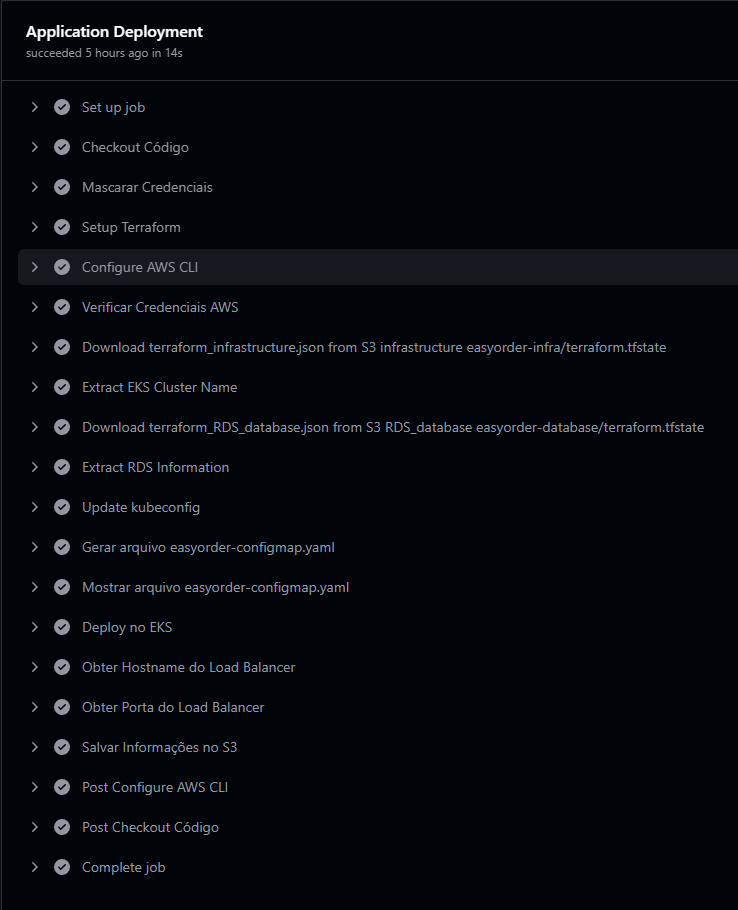

# easyOrder: Aplicação Tech Challenge POS TECH SOAT8 FIAP - Grupo 03

## ✒️ Grupo / Autores

O Grupo que implementou a solução (Grupo 03), é composto pelos seguintes integrantes (nome, email, RM, discord):
- Bruno Moreira Reis: brbrno@hotmail.com, RM358025, @bruno_m_reis
- Fernando Gurkievicz, fergkz@gmail.com, RM357072, @goorkz
- Marcio Saragiotto, marcio.saragiotto@gmail.com, RM357349, @msgiotto
- Matias Correa Franco de Faria, devmatiascff@gmail.com, RM357411, @matiasf8321
- Rafael da Silva Andrade, rafaandrade_@outlook.com, RM357010, @andrade_rafael

&nbsp;
# Repositório dedicado para Application 
- Inclui a conteúdo da aplicação, realizando a conexão com o Kubernetes 
- Utiliza Github Actions para CI/CD
- Oferece dados para correta configuração do repositório serverless

## Estrutura do Diretório

```plaintext
manifesto_kubernetes        
└── *.yaml                  - arquivos de configuração dos artefatos kubernetes
docs                        - documentações e guias de implementação
src                         - diretório principal com arquivos .tf
└── *.ts                    - código-fonte da aplicação
```

## Configuração do CI/CD

O repositório possui um workflow de CI/CD configurado com o Github Actions, que realiza a validação e deploy da application na AWS.

O workflow de CI é acionado a cada push no repositório, e executa as seguintes etapas:


O workflow de CD é dividido em duas partes a primeira acontece ao finalizar o push:


Em seguida acontece a parte manual que executa as seguintes etapas:



## Subindo a aplicação com o Github Actions (Produção)

Para subir a infraestrutura com o Github Actions, siga os passos abaixo:

1. Acesse o repositório do Github e clique na aba `Actions`, ou acesse diretamente o link abaixo:
 https://github.com/pos-tech-soat08-03/easyOrder-challenge3-application/actions

2. Clique no workflow `Application CD - Deploy no EKS` e em seguida clique no botão `Run workflow`

O workflow irá solicitar as chaves de acesso da AWS, que serão obtidas do ambiente do AWS Labs:

```plaintext
environment: <Ambiente de deployment (ex.: lab, staging, prod)>
aws_access_key_id: <AWS Access Key ID>
aws_secret_access_key: <AWS Secret Access Key>
aws_session_token: <AWS Session Token>
aws_account_id: <AWS Account ID>
aws_backend_bucket: <AWS S3 Bucket para armazenamento do estado do Terraform>
aws_region: <AWS Region>
```

Ao final da execução do workflow, a aplicação estará disponível na AWS, e o endpoint será disponibilizado para utilização no API Gateway no repositório serverless

## Subindo a aplicação manualmente (Desenvolvimento)

Para subir a aplicação manualmente:

Utilize as instruções do repositório easyOrder-challenge2(https://github.com/pos-tech-soat08-03/easyOrder-challenge2)

Pois o workflow foi montado para execução integrada com os recursos da AWS

## Documentação

Para mais informações sobre a arquitetura, verifique no repositório do desafio 3 (principal do projeto):
https://github.com/orgs/pos-tech-soat08-03/repositories