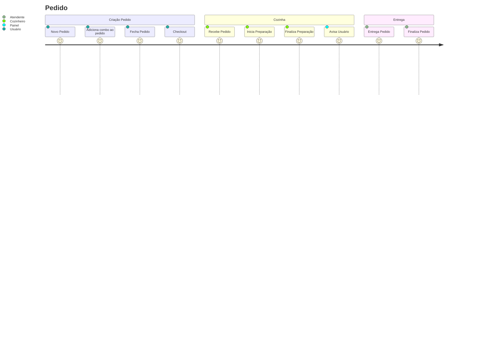
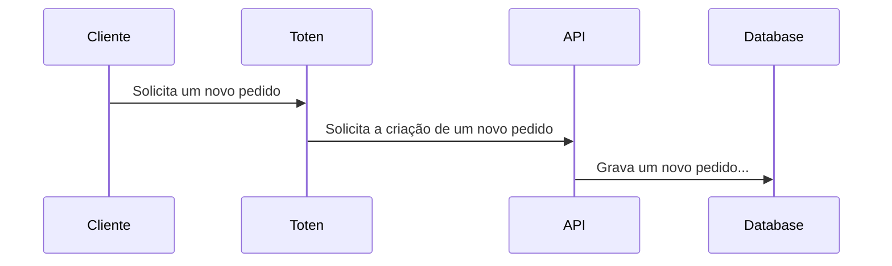

## Jornada do Cliente - Macro

# Fluxo Macro de Interação

# Regras de Negócio

RN1. Um pedido pode ser criado sem um cliente identificado (id do cliente)

RN2. Para fechar um pedido, deve existir ao menos um combo vinculado

RN3. Quando adicionar um produto ao combo, devemos verificar se o tipo do produto informado corresponde ao tipo de produto solicitando a inserção no combo

RN4. Só podemos adicionar ou remover combos ao pedido se este estiver no status EM_ABERTO

RN5. O combo deve ter ao menos um produto informado
